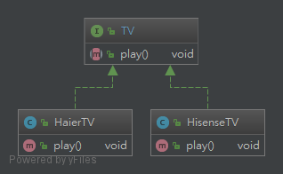
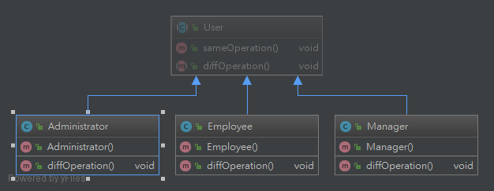

# 创建型模式
## 工厂方法模式（Factory Method Pattern）
### 1. 概述
&ensp; &ensp; 在简单工厂模式中只提供一个工厂类，该工厂类处于对产品类进行实例化的中心位置，它需要知道每一个产品对象的创建细节，并决定何时实例化哪一个产品类。简单工厂模式最大的缺点是当有新产品要加入到系统中时，必须修改工厂类，需要在其中加入必要的业务逻辑，这违背了“开闭原则”。此外，在简单工厂模式中，所有的产品都由同一个工厂创建，工厂类职责较重，业务逻辑较为复杂，具体产品与工厂类之间的耦合度高，严重影响了系统的灵活性和扩展性，而工厂方法模式则可以很好地解决这一问题。
### 2. 定义
&ensp; &ensp; 定义一个用于创建对象的接口，让子类决定将哪一个类实例化。工厂方法模式让一个类的实例化延迟到其子类。工厂方法模式又简称为工厂模式(Factory Pattern)，又可称作虚拟构造器模式(Virtual Constructor Pattern)或多态工厂模式(Polymorphic Factory Pattern)。工厂方法模式是一种类创建型模式。

### 3. 主要角色
1. Product（抽象产品）：它是定义产品的接口，是工厂方法模式所创建对象的超类型，也就是产品对象的公共父类。
2. ConcreteProduct（具体产品）：它实现了抽象产品接口，某种类型的具体产品由专门的具体工厂创建，具体工厂和具体产品之间一一对应。
3. Factory（抽象工厂）：在抽象工厂类中，声明了工厂方法(Factory Method)，用于返回一个产品。抽象工厂是工厂方法模式的核心，所有创建对象的工厂类都必须实现该接口。
4. ConcreteFactory（具体工厂）：它是抽象工厂类的子类，实现了抽象工厂中定义的工厂方法，并可由客户端调用，返回一个具体产品类的实例。

### 4.实现方式
#### 1.接口实现

#### 2.继承实现
